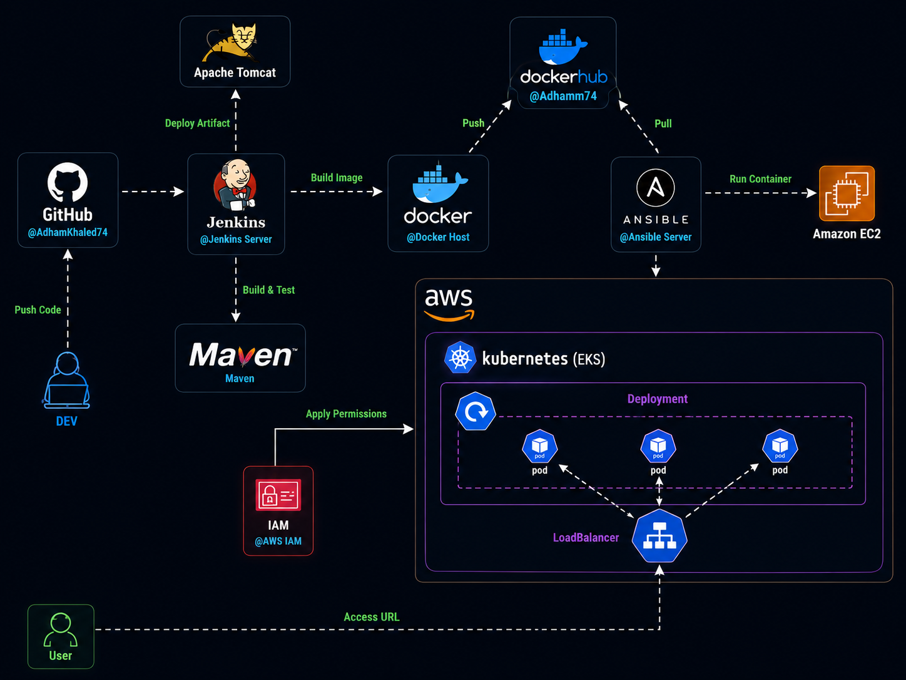
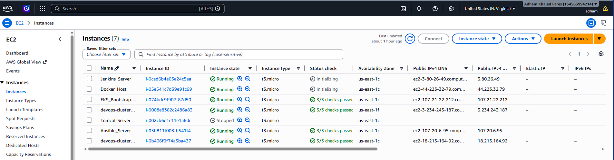
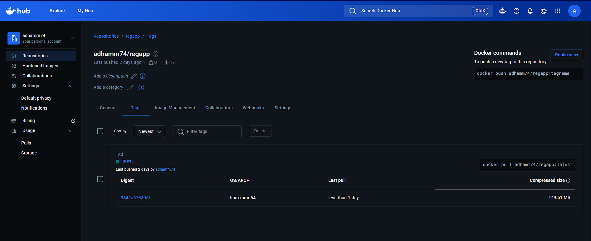

# End-to-End DevOps CI/CD Pipeline on AWS EKS

## Project Overview

This project demonstrates a complete End-to-End DevOps CI/CD pipeline for a Java web application. The pipeline automates the entire software delivery lifecycle, from code commit to deployment on a Kubernetes cluster running on AWS EKS.

The solution integrates modern DevOps tools and practices including source control, continuous integration, containerization, configuration management, container orchestration, and cloud infrastructure.

## Architecture



### CI/CD Workflow

1. Developer pushes code to GitHub.
2. Jenkins automatically pulls the latest code.
3. Maven builds and tests the Java application.
4. Jenkins packages the application as a WAR file.
5. Docker builds a container image.
6. Docker image is pushed to Docker Hub.
7. Ansible automates deployment tasks.
8. Kubernetes (AWS EKS) pulls the image from Docker Hub.
9. Deployment creates Pods and Services.
10. AWS LoadBalancer exposes the application to users.

## Technologies Used

- Git & GitHub
- Maven
- Jenkins
- Docker
- Docker Hub
- Ansible
- Kubernetes
- AWS EKS
- EKSCTL
- Apache Tomcat
- AWS IAM
- Amazon EC2

## Source Code

The Java application source code is available in the `hello-world` folder of this repository.

## AWS Infrastructure



### Jenkins Server

- Jenkins
- Maven
- Docker
- Git

### Ansible Server

- Ansible
- Docker

### EKS Management Server

- AWS CLI
- kubectl
- eksctl

## Docker Hub

Repository:
`adhamm74/regapp`



## EKS Cluster

```bash
eksctl create cluster \
--name devops-cluster \
--region us-east-1 \
--nodegroup-name workers \
--node-type t3.large \
```

## Deployment Verification

```bash
kubectl get nodes
kubectl get pods
kubectl get svc
kubectl describe deployment regapp
```

## Results

- Automated CI/CD Pipeline
- Dockerized Java Application
- Kubernetes Deployment on AWS EKS
- Automated Deployment using Ansible
- Continuous Integration using Jenkins
- Container Image Distribution through Docker Hub
- Highly Available and Scalable Infrastructure

## Key Skills Demonstrated

- CI/CD Pipeline Design
- Jenkins Administration
- Maven Build Automation
- Docker Containerization
- Docker Hub Integration
- Ansible Automation
- Kubernetes Deployments
- AWS EKS Management
- IAM Configuration
- Linux Administration
- Infrastructure Automation

## Author

**Adham Khaled**

GitHub: https://github.com/AdhamKhaled74

Docker Hub: https://hub.docker.com/u/Adhamm74
